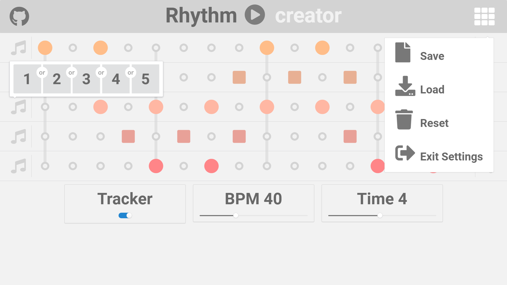

# RhythmCreator
An Open-Source tool for creating rhythms.

See also: https://en.wikipedia.org/wiki/Drum_machine.

Preview
--------------------
 

Live Demo
--------------------
https://rhythmcreator.herokuapp.com/

Requirements
--------------------
- **Node.js** (v10.6.0 or above)
- **NPM** (v6.1.0 or above)

Installation
--------------------
1. npm install
2. npm run server

License
-------
ConnectFourWeb is released under the terms of the MIT license. See https://opensource.org/licenses/MIT for more information.
